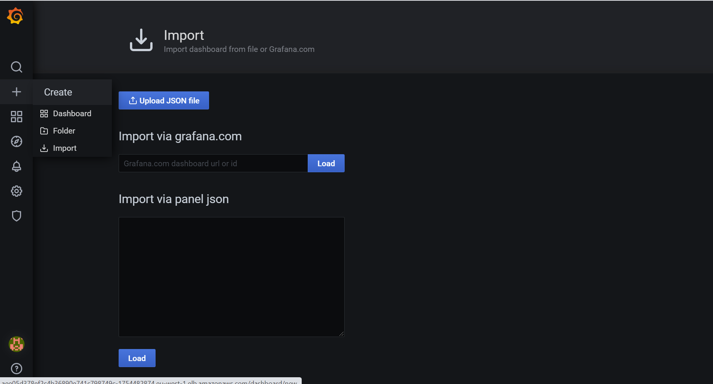
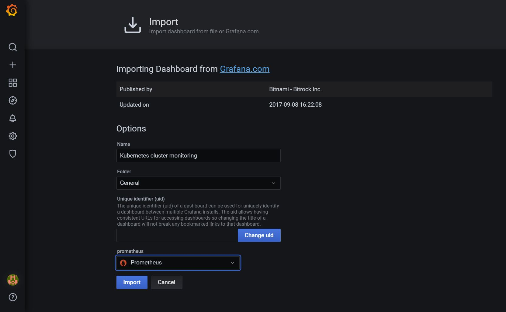
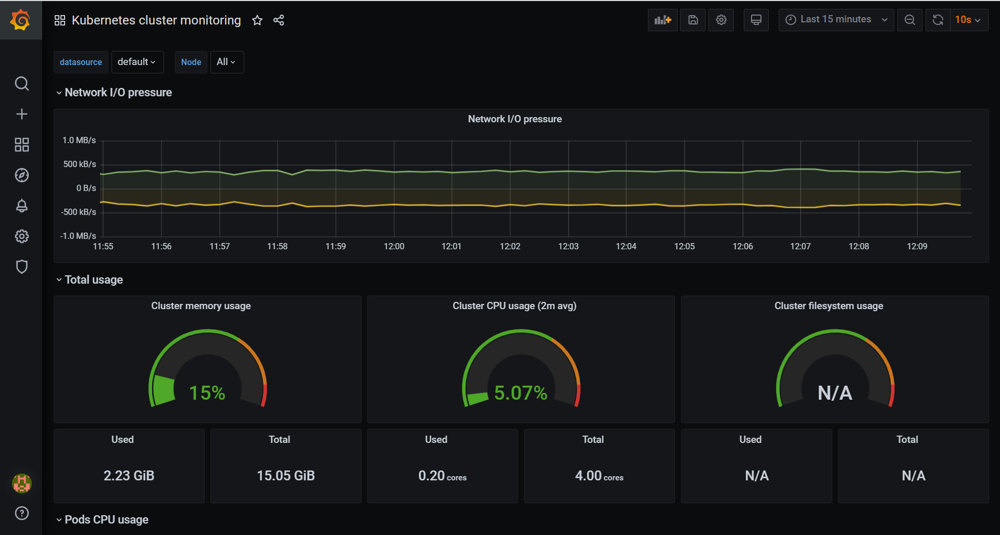

# Prometheus and Grafana installation on k8s cluster

1) Leverage helm to install metrics server on kube-system namespace
2) Leverage helm to install prometheus on monitoring namespace
3) Set prometheus to use EKS storage class "gp2"
4) Leverage helm to install grafana on monitoring namespace
5) Set basic variables to scrape metrics from prometheus using its service
6) Assign users and credentials for grafana UI

## Step 1
> Metrics server deployment
```
helm upgrade -i metrics ./metrics-server -n kube-system --set apiService.create=true
```

## Step 2
> Prometheus deployment

**To get recent version of prometheus and grafana it is adviced to deploy from helm repository**

```
helm repo add prometheus-community https://prometheus-community.github.io/helm-charts
helm repo add stable https://charts.helm.sh/stable
helm repo update

helm upgrade -i monitoring prometheus-community/prometheus --namespace monitoring --create-namespace --set alertmanager.persistentVolume.storageClass="gp2",server.persistentVolume.storageClass="gp2"
```
## Step 3
> Verfiy the deployments
```
kubectl get pods --namespace monitoring -w 
```
Make sure all the pods from monitoring namespace enters running state.

## Step 4
> Grafana deployment
```
helm upgrade -i grafana stable/grafana \
    --namespace monitoring\
    --set persistence.storageClassName="gp2" \
    --set persistence.enabled=true \
    --set adminPassword='EKS!sAWSome' \
    --set datasources."datasources\.yaml".apiVersion=1 \
    --set datasources."datasources\.yaml".datasources[0].name=Prometheus \
    --set datasources."datasources\.yaml".datasources[0].type=prometheus \
    --set datasources."datasources\.yaml".datasources[0].url=http://prometheus-server.monitoring.svc.cluster.local \
    --set datasources."datasources\.yaml".datasources[0].access=proxy \
    --set datasources."datasources\.yaml".datasources[0].isDefault=true \
    --set service.type=LoadBalancer
```
If you intend to deploy prometheus into different namespace that what was instructed on this readme then make sure you follow kubernetes dns representation on the above helm command
```
<prometheus_service_name>.<prometheus_namespace_name>.svc.cluster.local

translated below as

http://prometheus-server.monitoring.svc.cluster.local
```
## Step 5
> Verfiy the deployments
```
kubectl get pods --namespace monitoring

export SERVICE_IP=$(kubectl get svc --namespace monitoring grafana -o jsonpath='{.status.loadBalancer.ingress[0].hostname}')
```
Make sure all the pods from monitoring namespace enters running state and get the external ip to access grafana service from browser

## Step 6
> Get service url
```
 echo http://$SERVICE_IP:80
```
## Step 7
Once you land on the Grafana URL login page type in username as ***admin*** and use the password from running the below command
```
 kubectl get secret --namespace monitoring grafana -o jsonpath="{.data.admin-password}" | base64 --decode ; echo
```
## Step 8

Upon successful login you need to setup the Dashboard for Grafana, to do that click on the plus symbol on the left panel and select the "Import" option. You will be given a new window to grab the dashboard from grafana website and you can get the basic template by adding import number **3119** and press load



> Once loaded you need to give name for your dashbaord and select datasource



### Finally you have the Grafana dashboard up and running




### Now this can be further extended and accessed through ingress controller with SSL/TLS, to know more on basic understanding on ingress controller setup and working stack check here [kubernetes-ingress-controller](https://github.com/ashokjjk/react-kubernetes-ingress)

## Step 9

> Uninstall Prometheus and Grafana

```
helm uninstall prometheus grafana --namespace monitoring
```

You can find lot more grafana dashboard UI here [Grafana UI](https://grafana.com/grafana/dashboards?dataSource=prometheus&direction=desc&orderBy=reviewsCount)
